# Introduction

The following document explains the use of Windows Storage Replica along with Veeam Backup & Replication, to build a high available backup repository based on Windows Server 2016 and ReFS filesystem.

The idea behind this architecture comes after a request of a customer who loved the idea of backup appliances that have native replication logic.

Windows Storage Replica can transparently replicate an entire volume to a secondary server placed at DR site, providing customers with geographical redundancy. Replication process is also ReFS aware: all synthetic-created full backups do not need to be entirely replicated, only changes will be transferred to the replica destination.

In case of failure of the source volume, replication process can be inversed allowing Veeam Backup & Replication to continue the existing backup chains on the target (that has become the new source). As soon as the source has been brought back online, the failback process will be the same as the failover.

As every storage-based replica, Windows Storage Replica does not protect the volume content from logic corruption. Should something happen on the source, it will be replicated to the destination too. Veeam Backup & Replication has its native tool, the Backup Copy Job, that can be used to copy restore points between different backup repositories and it checks files CRC to guarantee data consistency.

## Windows Storage Replica concepts

Storage Replica, part of Windows Server 2016 Datacenter edition, is a technology that enables replication of volumes between servers or clusters for disaster recovery purposes.
It supports both synchronous and asynchronous replication. Synchronous mode is constrained to the latency between the servers, that must be below 5ms.

Synchronous replication mirrors data within a low-latency network site with crash-consistent volumes to ensure zero data loss at the file-system level during a failure.

Asynchronous replication mirrors data across sites beyond metropolitan ranges over network links with higher latencies, but without a guarantee that both sites have identical copies of the data at the time of a failure.

The minimum unit that can be replicated is a volume.

### Storage Replica Features

- Zero data loss, block-level replication. With synchronous replication, there is no possibility of data loss. With block-level replication, there is no possibility of file locking

- Simple deployment and management. Storage Replica has a design mandate for ease of use. Creation of a replication partnership between two servers can utilize the Windows Admin Center. Deployment of stretch clusters uses intuitive wizard in the familiar Failover Cluster Manager tool

- Guest and host. All capabilities of Storage Replica are exposed in both virtualized guest and host-based deployments. This means guests can replicate their data volumes even if running on non-Windows virtualization platforms or in public clouds, as long as using Windows Server 2016 Datacenter Edition in the guest

- SMB3-based. Storage Replica uses the proven and mature technology of SMB 3, first released in Windows Server 2012. This means all of SMB's advanced characteristics - such as multichannel and SMB direct support on RoCE, iWARP, and InfiniBand RDMA network cards - are available to Storage Replica

- Security. Unlike many vendor's products, Storage Replica has industry-leading security technology baked in. This includes packet signing, AES-128-GCM full data encryption, support for Intel AES-NI encryption acceleration, and pre-authentication integrity man-in-the-middle attack prevention. Storage Replica utilizes Kerberos AES256 for all authentication between nodes

- High performance initial sync. Storage Replica supports seeded initial sync, where a subset of data already exists on a target from older copies, backups, or shipped drives. Initial replication will only copy the differing blocks, potentially shortening initial sync time and preventing data from using up limited bandwidth. Storage replicas block checksum calculation and aggregation means that initial sync performance is limited only by the speed of the storage and network

- Consistency groups. Write ordering guarantees that applications such as Microsoft SQL Server can write to multiple replicated volumes and know the data will write on the destination server sequentially

- User delegation. Users can be delegated permissions to manage replication without being a member of the built-in Administrators group on the replicated nodes, therefore limiting their access to unrelated areas

- Network Constraint. Storage Replica can be limited to individual networks by server and by replicated volumes, in order to provide application, backup, and management software bandwidth

- Thin provisioning. Support for thin provisioning in Storage Spaces and SAN devices is supported, in order to provide near-instantaneous initial replication times under many circumstances

### Prerequisites

- Windows Server 2016 Datacenter edition

- Active Directory Domain Services forest

- Storage Spaces with SAS JBODs, Storage Spaces Direct, fibre channel SAN, shared VHDX, iSCSI Target, or local SAS/SCSI/SATA storage. SSD or faster recommended for replication log drives. Microsoft recommends that the log storage be faster than the data storage. Log volumes must never be used for other workloads

- At least one ethernet/TCP connection on each server for synchronous replication, but preferably RDMA

- At least 2GB of RAM and two cores per server

- A network between servers with enough bandwidth to contain your IO write workload and an average of 5ms round trip latency or lower, for synchronous replication. Asynchronous replication does not have a latency recommendation
- Source and target volumes must have the same size

- Log volumes must have the same size
- Log volumes must be initialized as GPT, not MBR

### Firewall

The replication process requires ICMP and ports 445 and 5445 opened.

## Best Practices

When designing this kind of architecture there are some concept that must be kept in mind:

- ReFS BPs are the same as standard repository
- Better to use thin provisioned volume (S2D preferred) as they can dramatically reduce initial sync time. From a storage-based replica perspective a block is a block, either or not it is empty it must be replicated anyway.
- Use per-VM backup chains as they can help to achieve a better RPO. More file to copy means more granularity: in case of a failure during the replication, having multiple files to work with will increase the chance to copy it in a timely fashion.

Based on Microsoft recommendation there should not be any performance drop using thin volumes (compared to thick).

During the process of creating the replication partnership the latency between source and destination is tested. If it was below 5ms the replication is set automatically in synchronous mode. I suggest to manually switch it to asynchronous because it is more appropriate to handle backup files. Also, DR site might be geographically isolated from the main site and, in this case, having a latency below 5ms could not be possible.

Windows Storage Replica requires a log volume on both servers. The optimal size of the log varies widely depending on the environment and how much write IO is generated during the backup session.

- A larger or smaller log does not make the repository any faster or slower
- A larger or smaller log does not have any bearing on a 10GB data volume versus a 10TB data volume, for instance

A larger log simply collects and retains more write IOs before they are wrapped out. This allows an interruption in service between the source and destination computer, such as a network outage or the destination being offline, to go longer. This is fairly impossible when using this architecture to replicate backup files as we would plan to have a log volume which is nearly large as the incremental size of an entire backup session. That said, 100 to 200 GB should fit most of the environment.

Storage Replica relies on the log to speed up writes on data disks and log performance is critical to replication performance. You must ensure that the log volume performs better than the data volume, as the log will serialize and sequentialize all write IO.

### Architecture


## Environment setup

The following steps will guide you through the configuration of volumes with Windows Storage Spaces Direct (referred as S2D), the creation of the replication group and the integration with Veeam Backup & Replication.

### Install prerequisites

Windows Storage Replica is a feature that must be installed as it is not part of the standard installation of Windows Server 2016.
What follows must be done on both nodes:

- Open the server manager and click “Add Roles and Features”

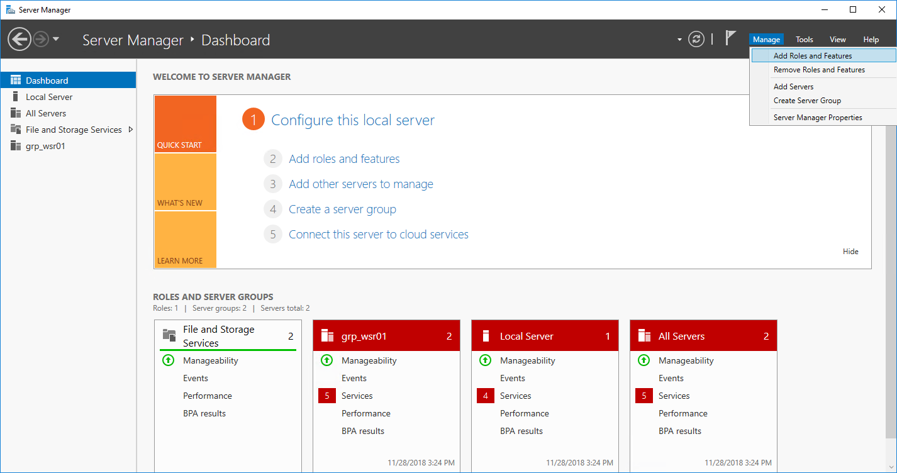

- In “Features” menu select Storage Replica

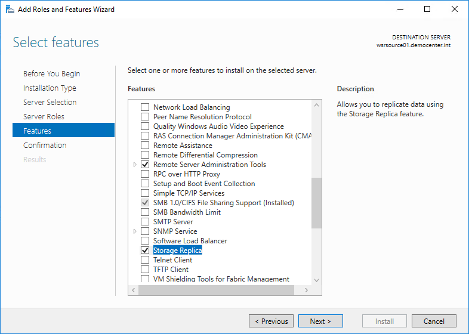

- Complete the wizard and reboot both the servers

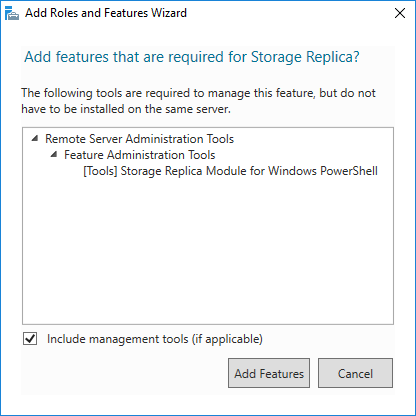

### Prepare log volumes

What follows must be done on both nodes:

- Bring online the disk, initialize it as GPT disk and create a volume


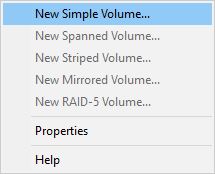

- Format it as ReFS (no 64KB required here)

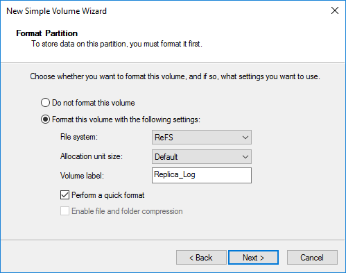

### Configure S2D

Tips: the entities that will be created are three on each node

- Storage Pool
- Virtual Disk
- Volume

Use names that can easily identify the entity and its location (what node). Here are the names that will be used:

| Object | Node WSRSOURCE01 | Node WSRTARGET01 |
| -- | -- | -- |
| Storage Pool | sp_wsrsource01 | sp_wsrtarget01 |
| Virtua Disk | vdisk_repo_src00 | vdisk_repo_tgt00 |
| Volume | vol_repo_src00 | vol_repo_tgt00 |

What follows must be done on both nodes:

- Create the Storage Pool


- Specify name and description

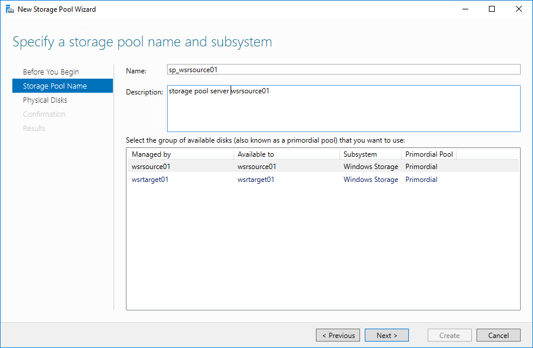

- select disks


- confirm to complete the process

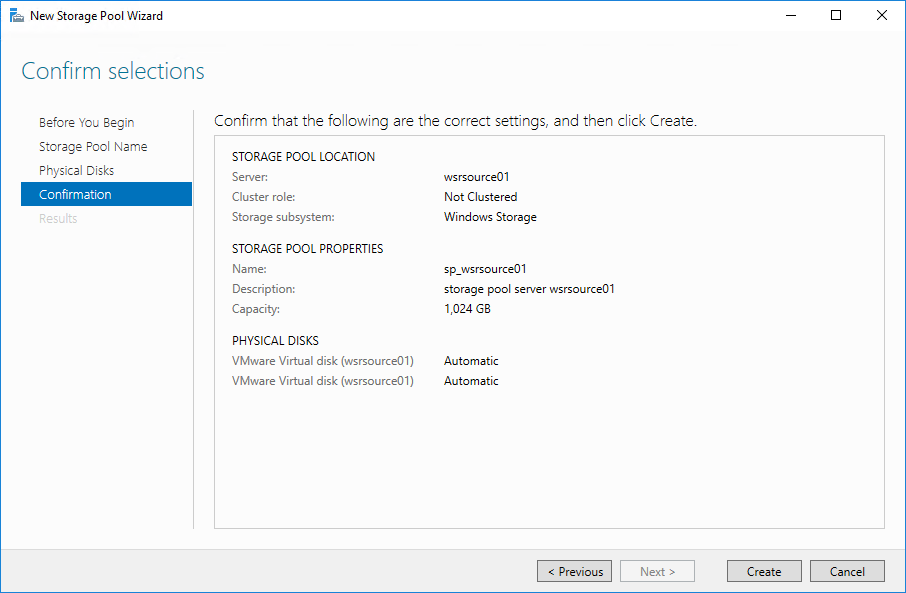

### Create virtual disk

What follows must be done on both nodes:

- Create a new virtual disk

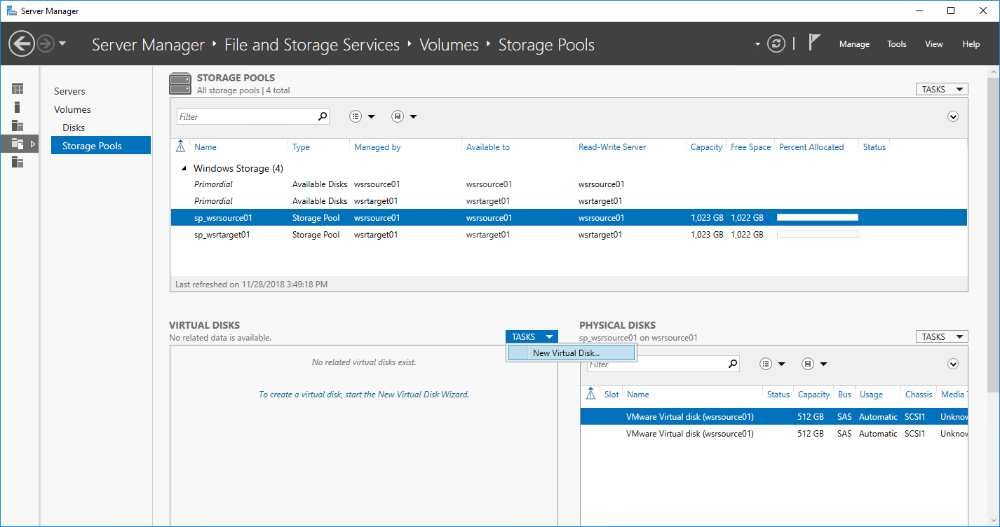

- Name it and specify enclosure awareness

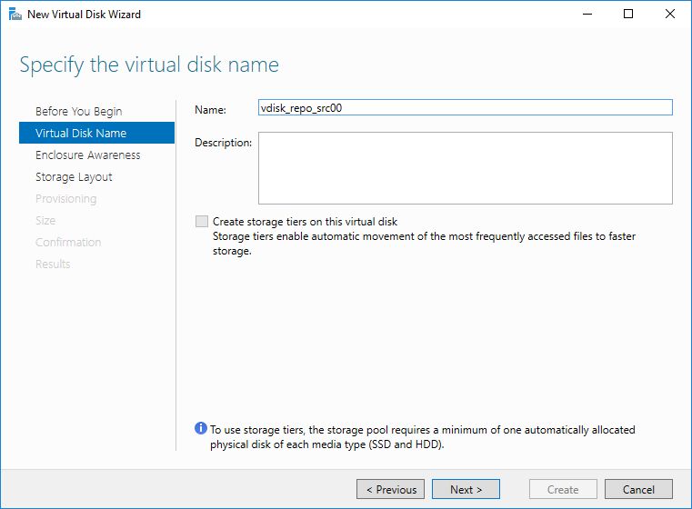

- Select a storage layout based on the protection level desired (Simple, Mirror, Parity)
- Select thin provisioning

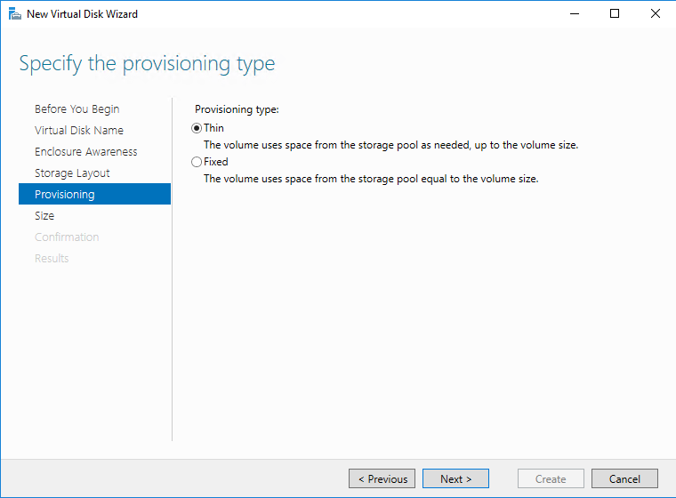

- Set a size and complete the wizard leaving the option to create the volume checked


### Create volumes

What follows must be done on both nodes:

- Go through the wizard, set a size, letter and format it with ReFS (use 64 KB cluster size)

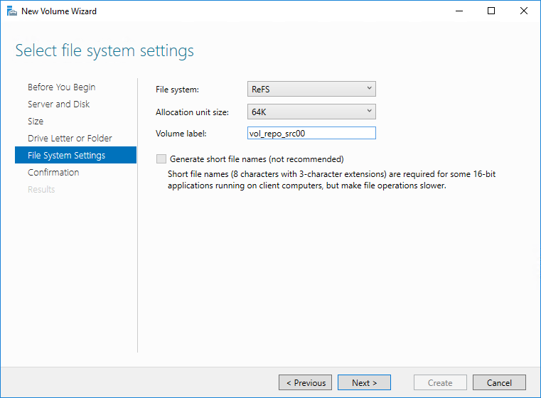

## Integration with Veeam Backup & Replication

Before setting up the replication partnership, it is necessary to configure both the repositories (source and destination) in Veeam Backup & Replication as you would with any standard ReFS repository.

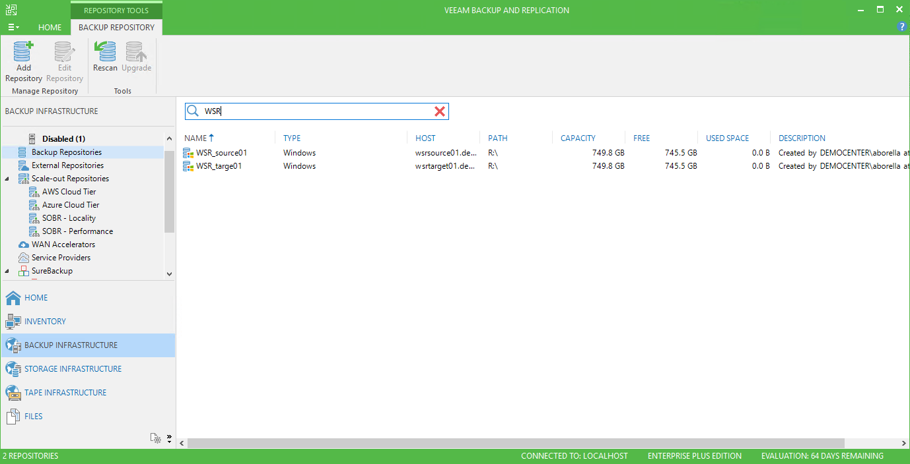

Once the replication partnership is set, the destination volume will remain not accessible thus VBR will not let you configure it.

Set on both the repositories to use per-VM backup files:

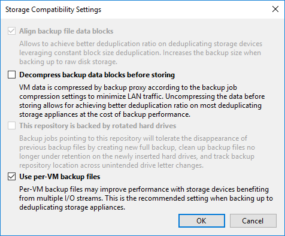

## Create the replication partnership

From now on, if not different noted, all the commands must be issued on the source server.

- The first step is to test if the partnership can be created. The cmdlet will test for 10 minutes (it can be changed) both log and data disk performances and it calculates latency between source and destination.

As result an html report will be generated under C:\tmp. Check it out for any warning before moving forward.

``` powershell
$sourcesrv="wsrsource01.democenter.int"
$sourcevolume="r:"
$sourcelogvolume="e:"
$destsrv="wsrtarget01.democenter.int"
$destvolume="r:"
$destlogvolume="e:"


Test-SRTopology -SourceComputerName $sourcesrv -SourceVolumeName $sourcevolume -SourceLogVolumeName $sourcelogvolume -DestinationComputerName $destsrv -DestinationVolumeName $destvolume -DestinationLogVolumeName $destlogvolume -DurationInMinutes 10 -ResultPath c:\tmp
```

- Create the partnership and set log size

``` powershell
$sourcesrv="wsrsource01.democenter.int"
$sourcevolume="r:"
$sourcelogvolume="e:"
$destsrv="wsrtarget01.democenter.int"
$destvolume="r:"
$destlogvolume="e:"


New-SRPartnership -SourceComputerName $sourcesrv -SourceRGName replica-rg01-source -SourceVolumeName $sourcevolume -SourceLogVolumeName $sourcelogvolume -DestinationComputerName $destsrv -DestinationRGName replica-rg01-dest -DestinationVolumeName $destvolume -DestinationLogVolumeName $destlogvolume -ReplicationMode Asynchronous
Set-SRGroup -LogSizeInBytes 97710505984 -Name replica-rg01-source
```

- Set log size on destination node (use either Enter-PSSession -ComputerName xxxx or RDP)

```powershell
Set-SRGroup -LogSizeInBytes 97710505984 -Name replica-rg01-source
```

- Set the restriction on the interface that must be used for replication traffic (optional)

```powershell
#Use Get-NetIPConfiguration to find interface names

Get-SRPartnership | Set-SRNetworkConstraint -SourceNWInterface 7 -DestinationNWInterface 3

Update-SmbMultichannelConnection
```

## Monitoring

There are many methods to keep track of replication progress and errors. However, it is not possible to use just one tool and, in some cases, commands must be executed on the target or on the source node.

### Replica status and remaining GBs

To get replication status use (on source server):

```powershell
PS C:\Windows\system32> (Get-SRGroup).Replicas

CurrentLsn          : 70366
DataVolume          : R:\
LastInSyncTime      :
LastKnownPrimaryLsn : 70366
LastOutOfSyncTime   :
NumOfBytesRecovered : 1410928
NumOfBytesRemaining : 0
PartitionId         : f1b8ba33-c631-43f6-88b6-494a2c5d9f12
PartitionSize       : 805170053120
ReplicationMode     : Asynchronous
ReplicationStatus   : ContinuouslyReplicating_InRPO
PSComputerName      :
```

This command gives also useful information about the replication groups: it tells the replication mode (synchronous or asynchronous) and either if the replica is aligned or not.

NumOfBytesRemaining here **will always be 0.**

To get remaining data to be replicated use the same command on the destination server, or use this script to constantly update the Powershell window with the remaining amount.

Change the -Name “xxxxx” accordingly. To get SRGroup names use Get-SRGroup.

```powershell
#must be used on destination

do{
    $r=(Get-SRGroup -Name "replica-rg01-dest").replicas
    [System.Console]::Write("Number of remaining GB {0}`n", [math]::Round($r.NumOfBytesRemaining/1GB,2))
    Start-Sleep 2
}until($r.NumOfBytesRemaining -eq 0)
Write-Output "Replica Status: synced"
```

## Replication events

Windows Storage Replica events can be easily retrieved with Powershell. Run:

``` powershell
Get-WinEvent -ProviderName Microsoft-Windows-StorageReplica | Select-Object -First 20
```

### Relevant events

When monitoring replication events, the most useful ones that can give you a complete outlook on the replication status can be found on the target node.

Here is some example:


- **Event 5010** is triggered every time the replication state return within the RPO, that means all the modified blocks on the source have been copied and the replication if completely aligned
- **Events 1200, 1203, 1201, 1237** are triggered when new blocks are written on the source and the replication process starts

Regarding events on the source, one thing worth noticing is an error that should be considered as warning instead:


**Events ID 1239** is triggered when new data are written on the source and, at that moment in time, the replication is not longer in RPO. As soon as the data have been copied to the destination, event 1240 is logged (usually along with event 5010 on the target server).

## Windows Performance Monitor

Performance monitor can be used to build charts, with different metrics, on replication statistics. Run “perfmon.msc”, click on the “+” (plus) sign to build a new dashboard, in the counter list select counters from these two containers.


## Failover

In case of failure of the source node, replication direction can be easily switched allowing VBR to continue backup chains (no need to create new full) on the target repository.
Use the following command on the target server to switch the direction:

```powershell
$sourcesrv="wsrsource01"
$sourcerg="replica-rg01-source"
$destsrv="wsrtarget01"
$destrg="replica-rg01-dest"

Set-SRPartnership -NewSourceComputerName $destsrv -SourceRGName $destrg -DestinationComputerName $sourcesrv -DestinationRGName $sourcerg
```

As soon as the command has been executed, the volume that contains replicated data is mounted in writeable state and from now on all new written data will be replicated on the former source server (that is now the new target).
If the source server is offline, the replica state will not be in RPO, but it will be “Waiting for the destination”. That is expected as the destination is offline.
Use, on the target server, Get-SRPartnership and Get-SRGroup to check the state:


Note how source and destination are changed.

### Edit job configuration in VBR

As soon as the data are accessible on the destination server, job in VBR can be pointed to secondary repository:


Jobs will continue as usual (in this case the next run was an incremental):


All the job metadata have successfully been updated:


## Failback

### Same destination

To failback to the original state, just switch the replica repeating all the above to inverse target with source:

```powershell
$sourcesrv="wsrsource01"
$sourcerg="replica-rg01-source"
$destsrv="wsrtarget01"
$destrg="replica-rg01-dest"

Set-SRPartnership -NewSourceComputerName $sourcesrv -SourceRGName $sourcerg -DestinationComputerName $destsrv -DestinationRGName $destrg
```

This scenario is intended to be used when the source server is returned online, and the replication baseline still exists.

A consistency check will be performed and only needed blocks will be transferred.

### New destination

In case of a disaster the original location could not be available anymore. It is possible to recreate the replication partnership with a new server, that will become the new source but, in this case, the replication partnership must be first destroyed.

Use the following commands on the target server to break the partnership:

```powershell
Get-SRPartnership | Remove-SRPartnership
Get-SRGroup | Remove-SRGroup
```

Remove the old primary repository from VBR configuration, set up the new one pointing the new server and create the partnership using the secondary server as source. As soon as the replica is synced, inverse it and configure VBR accordingly.

## Upgrade to Windows Server 2019

The in-place upgrade process to Windows Server 2019 will be supported and will introduce a new feature that gives the ability to mount a snapshot of the destination volume while replication keeps happening.

Thinking a this in Veeam’s world, it would open different scenario where data at destination can be used a source for DataLabs as well for SureBackup jobs without impacting on the primary infrastructure or even use data at destination as source for replication job using backup files.

A short demo of this capability can be found [here](https://blogs.technet.microsoft.com/filecab/2018/04/24/storage-replica-updates-in-windows-server-2019-insider-preview-build-17650/).

### Upgrade from Windows Server 2016

As in-place upgrade is supported, it’s possible to upgrade both the servers without impacting on the backup process.
Let’s assume that Storage Replica happens between node A and node B, where A is the source. The recommended process is:

- Upgrade B
- After upgrade get A and B in sync
- Switch direction making B as primary and A as secondary
- Upgrade A
- After upgrade get B and A in sync
- Switch direction to get back to the normal state (A to B)

### Mount destination volume

Windows Server 2019 allows target disks to be mounted. A snapshot of the data will be created and saved into a temporary position. Depending on the size of the expected changes (while the snapshot is open) more free space might be required.

Use the following command to mount the disk:

```powershell
Mount-SRDestination -Name replica-rg01-desk -Computername wsrtarget01 -TemporaryPath C:\wsrmount
```

The target volume will be mounted with its own letter and it will be writeable. Any changes made to the filesystem will be saved on the temporary path given with the command and they will be discarded as soon as the snapshot will be removed with the following command:

```powershell
Dismount-SRDestination -Name replica-rg01-dest -Computername wsrtarget01
```
